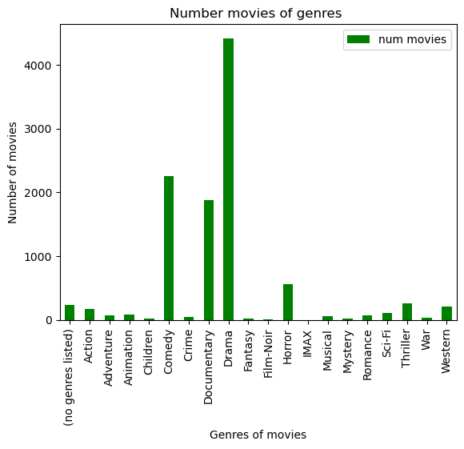

# Related movies recommendation
Related movies recommendation Machine Learning Project

## Datasets : 
This Datasets for analysis and training are collected from MovieLens 20M Dataset in Kaggle. 

- Link to dataset : [http://grouplens.org/datasets/movielens/20m/](https://www.kaggle.com/datasets/grouplens/movielens-20m-dataset)

## Frameworks : 
* [Python](https://www.python.org/)
* [Numpy](https://numpy.org/)
* [Pandas](https://pandas.pydata.org/)
* [Scikit-learn](https://scikit-learn.org/stable/)

## Steps in the project : 
1. Analyze the data set to find out the voting trends of movie genres.
2. Build a movie recommendation system based on K-Means.

## Result of project:
### 
From the collected data, two DataFrames representing information about movies and movie genres were found with the help of Pandas Framework.

DataFrame representing information of movies, which was saved to the file 'movie_rating.csv:

DataFrame representing information of movies, which was saved to the file 'Genre_Rating.csv:

Наименование | Пин | sdsdsd
:----|----|----:
 |    |  

